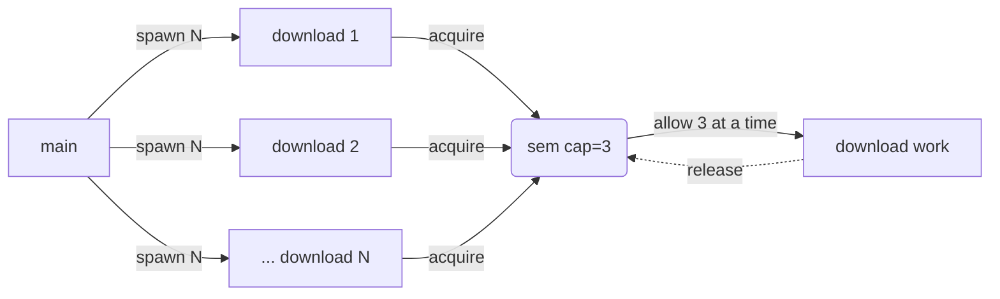

# bounded-downloader

Download a list of files concurrently, but cap how many run at once. The downloads themselves are simulated (variable sleep) so the example needs no network.

Demonstrates the [concurrency-limit-semaphore](../../patterns/concurrency-limit-semaphore) pattern in a realistic shape: each download spawns its own goroutine, and a semaphore caps how many actually run their critical section at the same time.

## How it works


Every download is its own goroutine, but the buffered semaphore channel only lets 3 run their work at any moment. Others wait at `sem <- struct{}{}` until a slot frees.

## Run it
```bash
go run ./examples/bounded-downloader
```

## Example output
```
[main] downloading 10 files, 3 at a time
[file-10.zip] waiting for slot
[file-10.zip] downloading
[file-01.zip] waiting for slot
[file-01.zip] downloading
[file-05.zip] waiting for slot
[file-04.zip] waiting for slot
...
[file-10.zip] done in 277ms (7683 bytes), releasing slot
[file-04.zip] downloading
[file-05.zip] done in 474ms (9108 bytes), releasing slot
[file-08.zip] downloading
...
[main] downloaded 10 files, 59383 total bytes
```
