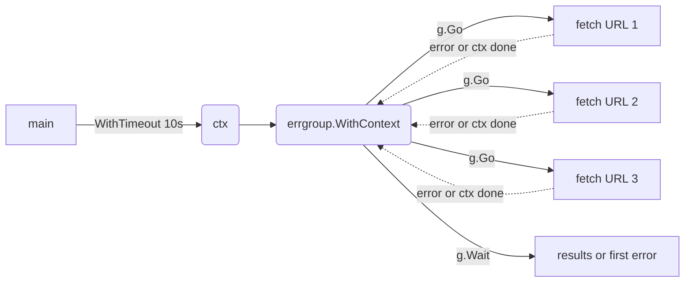

# concurrent-fetcher

Fetch a list of URLs in parallel. If any fetch fails, cancel the others and return the first error.

Combines [errgroup](../../patterns/errgroup) with [context-timeout](../../patterns/context-timeout) for both fail-fast cancellation and an overall deadline.

## How it works


Each fetch runs in its own goroutine via `g.Go`. The shared context carries the 10s deadline; errgroup cancels it on the first failure so siblings stop wasting work.

## Run it
```bash
go run ./examples/concurrent-fetcher
```

Needs network. Hits `example.com`, `iana.org`, and `httpbin.org`.

## Example output
```
[main] fetching 3 URLs in parallel (errgroup + context)
[fetch] starting https://httpbin.org/status/200
[fetch] starting https://www.iana.org/help/example-domains
[fetch] starting https://example.com
[fetch] done     https://example.com -> 200 (528 bytes)
[fetch] done     https://www.iana.org/help/example-domains -> 200 (4702 bytes)
[fetch] done     https://httpbin.org/status/200 -> 200 (0 bytes)
[main] summary:
  https://example.com                                -> 200 (528 bytes)
  https://www.iana.org/help/example-domains          -> 200 (4702 bytes)
  https://httpbin.org/status/200                     -> 200 (0 bytes)
```
