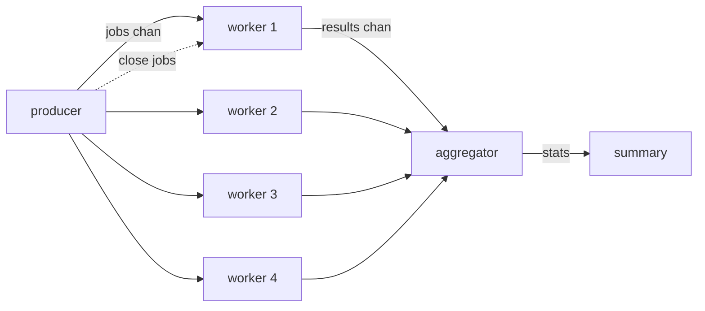

# job-queue-worker-pool

Background job processing with a fixed pool of worker goroutines. The producer enqueues jobs as they arrive; workers pick them up, process them (some succeed, some fail), and emit results.

This is the shape of most "background worker" systems: a queue, a pool of workers, and a result aggregator.

Built on the [worker-pool](../../patterns/worker-pool) pattern.

## How it works


- Producer drips jobs into a buffered channel and `close`s it when done.
- 4 workers `range` over the jobs channel; closing it lets each worker's loop exit.
- Each worker emits a `Result` (with worker ID, job ID, ok/fail, duration).
- Aggregator collects results, computes summary stats.
- A `WaitGroup` waits for all workers before closing the results channel so the aggregator's range exits.

## Run it
```bash
go run ./examples/job-queue-worker-pool
```

## Example output
```
[worker 1] online
[worker 3] online
[worker 2] online
[worker 4] online
[producer] enqueue job 1
[worker 1] picked up job 1 (payload-1)
[producer] enqueue job 2
[worker 3] picked up job 2 (payload-2)
...
[worker 2] job 5 FAILED
[worker 2] picked up job 8 (payload-8)
...
[producer] all jobs enqueued, queue closed
...
[worker 2] queue closed, shutting down
[main] processed 15 jobs (13 ok, 2 failed), avg 281ms per job
```
