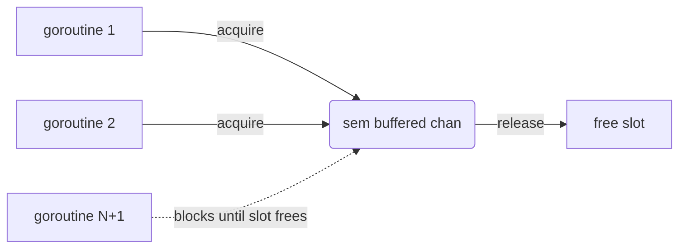

# concurrency-limit-semaphore

## Problem
Many goroutines each want to run a short critical section, but only N may be doing it at once (open file descriptors, outbound HTTP connections, expensive CPU work).

## When to use
- Each unit of work wants its own goroutine, but the underlying resource is bounded.
- The cap matters more than reusing workers.
- You want a primitive that's a single buffered channel, not a worker-pool struct.

## How it works


A buffered channel of size N is a counting semaphore. A goroutine sends to acquire (blocks if full) and receives to release. The buffer size IS the concurrency cap.

Compare with [worker-pool](../worker-pool): worker-pool keeps N goroutines alive across many jobs; a semaphore lets each task spawn its own goroutine and only caps the gated section.

## Example output
```
[main] launching 10 tasks, capped at 3 concurrent
[task 10] waiting for slot
[task 10] acquired slot, working
[task  4] waiting for slot
[task  4] acquired slot, working
[task  3] waiting for slot
[task  3] acquired slot, working
[task  2] waiting for slot
...
[task  3] releasing slot
[task  2] acquired slot, working
...
[main] all tasks complete
```

## Run it
```bash
go run ./patterns/concurrency-limit-semaphore
```
