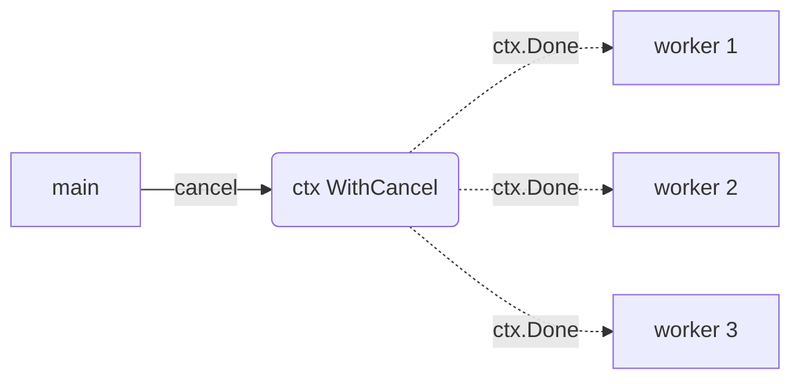

# context-cancel

## Problem
Multiple goroutines (and any work they spawn) need to be cancelled together when the caller decides to give up.

## When to use
- The modern replacement for the quit-channel pattern.
- Cancellation must propagate to derived contexts (HTTP requests, DB queries, child goroutines).
- You want a single, idiomatic standard-library mechanism.

## How it works


`context.WithCancel` returns a context and a `cancel` function. Calling `cancel` closes the context's `Done` channel; every goroutine selecting on `ctx.Done()` sees it immediately and exits. Standard-library functions (`http.NewRequestWithContext`, `db.QueryContext`, etc.) accept a context, so cancellation propagates into IO without extra plumbing.

For deadlines, use [context-timeout](../context-timeout).

## Example output
```
[main] workers running for 600ms then cancelling
[worker 1] starting
[worker 1] working iteration 0
[worker 2] starting
...
[main] cancel() called, waiting for workers to observe
[worker 1] cancelled (context canceled) after 4 iterations
[worker 3] cancelled (context canceled) after 4 iterations
[worker 2] cancelled (context canceled) after 4 iterations
[main] done
```

## Run it
```bash
go run ./patterns/context-cancel
```
