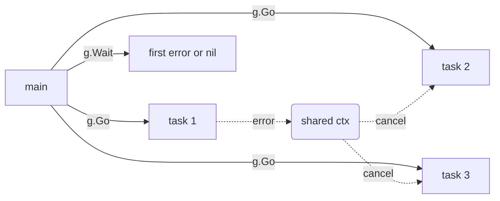

# errgroup

## Problem
Run several goroutines in parallel; if any of them fails, you want to (a) get the first error and (b) cancel the rest so they stop wasting work.

## When to use
- Concurrent IO with fail-fast semantics (parallel HTTP calls, parallel DB queries).
- A WaitGroup would do, except your goroutines can return errors and you need them.
- You want shared cancellation propagated through `context.Context`.

## How it works


`errgroup.WithContext` returns a Group AND a context. The first goroutine to return non-nil error makes the Group cancel the context; siblings observing `ctx.Done()` exit early. `g.Wait()` returns the first error (or nil if all succeeded).

Uses `golang.org/x/sync/errgroup`.

## Example output
```
[main] waiting for group
[slow-task-1      ] starting (will take 1s)
[fast-failing-task] starting (will take 150ms)
[slow-task-2      ] starting (will take 2s)
[fast-failing-task] failing
[slow-task-1      ] cancelled by sibling failure: context canceled
[slow-task-2      ] cancelled by sibling failure: context canceled
[main] group failed: fast-failing-task failed after 150ms
```

## Run it
```bash
go run ./patterns/errgroup
```
