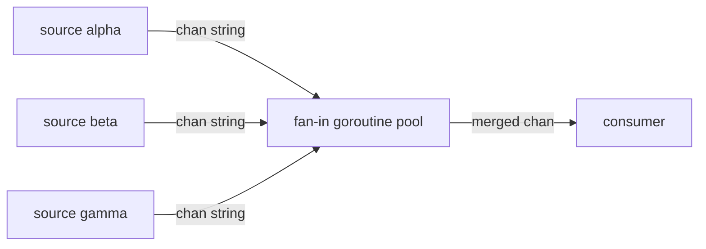

# fan-in

## Problem
Several goroutines produce values on separate channels; you want to consume them as a single combined stream.

## When to use
- Aggregating events from multiple sources (sensors, sockets, log tailers).
- Merging the outputs of a fan-out stage back into one channel.
- Reducing many channels to one so the consumer doesn't need a select.

## How it works


One goroutine per input channel reads its source and forwards onto a shared output. A `WaitGroup` tracks them; once all input channels are drained the WaitGroup hits zero and a separate goroutine `close`s the merged channel so the consumer's range exits.

## Example output
```
[main] consuming merged stream from 3 sources
[merged] beta  msg 0
[merged] alpha msg 0
[merged] gamma msg 0
[merged] gamma msg 1
[merged] alpha msg 1
[merged] gamma msg 2
[merged] beta  msg 1
...
[main] all sources drained
```

## Run it
```bash
go run ./patterns/fan-in
```
