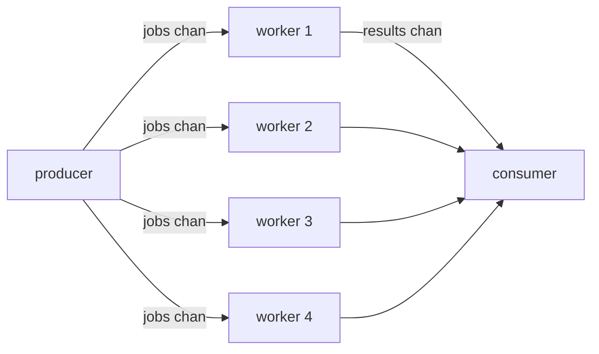

# fan-out

## Problem
A single producer emits a stream of work; you want N goroutines pulling from it concurrently to spread the load.

## When to use
- Parallelizing CPU-bound or IO-bound transformations.
- Throughput is bounded by per-item work, not by upstream rate.
- The order of results doesn't have to match the order of inputs.

## How it works


All workers share one input channel and one output channel. Go's runtime decides which worker gets the next value; whichever is ready first wins. Pair this with [fan-in](../fan-in) (or use a shared output channel like here) to recombine the results.

## Example output
```
[main] dispatching 12 jobs to 4 workers
[worker 1] started
[worker 4] started
[worker 2] started
[worker 3] started
[result] worker 2 processed job 3 -> 9
[result] worker 3 processed job 4 -> 16
[result] worker 4 processed job 2 -> 4
[result] worker 1 processed job 1 -> 1
...
[main] done
```

## Run it
```bash
go run ./patterns/fan-out
```
