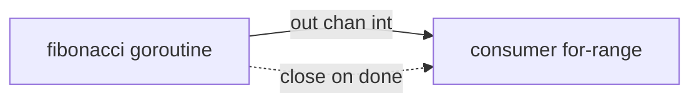

# generator

## Problem
Lazily produce a sequence of values from a goroutine and let the caller pull them on demand.

## When to use
- Streaming a sequence the caller consumes one at a time.
- Decoupling production rate from consumption rate.
- Hiding goroutine creation behind a function that just returns a channel.

## How it works


The function spawns a goroutine, hands back a receive-only channel, and the caller `range`s over it. The goroutine `close`s the channel when the sequence ends, so the consumer's range loop exits naturally.

## Example output
```
[main] starting consumer over fibonacci(8)
[generator] producing fib(0) = 0
[consumer] received 0
[generator] producing fib(1) = 1
[consumer] received 1
[generator] producing fib(2) = 1
[consumer] received 1
[generator] producing fib(3) = 2
[consumer] received 2
...
[generator] done, closing channel
[main] done
```

## Run it
```bash
go run ./patterns/generator
```
