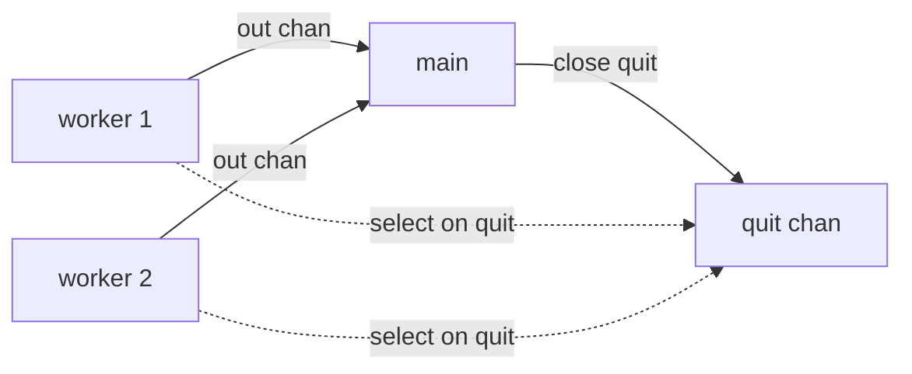

# graceful-shutdown

## Problem
Long-running goroutines need to be told "stop, finish what you're holding, and exit," not just killed.

## When to use
- Background workers that must release resources before exiting.
- Shutdown on SIGINT/SIGTERM, deadline, or upstream completion.
- A simpler alternative to context for in-process signaling.

## How it works


Each worker `select`s between doing work and reading from a shared `quit` channel. `close(quit)` makes every receive on it succeed immediately, so all workers see the signal at once and exit their loops.

For new code, prefer `context.Context` (see [context-cancel](../context-cancel)). The pattern here is the same idea without the standard-library wrapper.

## Example output
```
[worker 2] starting
[main] worker 2 tick 0
[worker 1] starting
[main] worker 1 tick 0
[main] worker 1 tick 1
[main] worker 2 tick 1
...
[main] signalling shutdown
[worker 1] quit received, exiting after 5 ticks
[worker 2] quit received, exiting after 5 ticks
[main] done
```

## Run it
```bash
go run ./patterns/graceful-shutdown
```
