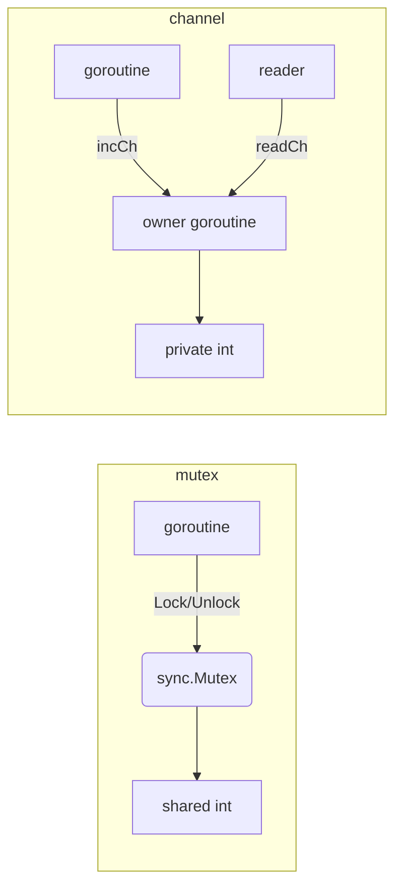

# mutex-vs-channel

## Problem
You have shared state (a counter, a map, a cache). Should you protect it with `sync.Mutex` or own it inside a goroutine accessed via channels?

## When to use
- Use **mutex** when:
  - state is small and accessed in tight bursts (counter, map),
  - operations are short and synchronous,
  - you just need to prevent torn reads or writes.
- Use **channel-owned state** when:
  - state already coordinates goroutine lifecycles (workers, pipelines, event loops),
  - operations are naturally request/response,
  - you want a clear single-owner boundary that's easy to extend with new operation types.

For a plain shared variable, the mutex form is shorter and faster. Reach for channels when communication is the point, not when it's overhead wrapping a guarded variable.

## How it works


Mutex serializes access to a shared variable. The channel version moves the variable into a single owner goroutine and serves requests over channels (the CSP "share memory by communicating" form).

## Example output
```
[main] running mutex-protected counter (10000 goroutines)
[mutex]   final count: 10000  (took 3.615ms)
[main] running channel-owned counter (10000 goroutines)
[channel] final count: 10000  (took 9.93ms)
[main] both correct; mutex is typically faster for this shape of problem
```

Both produce the same answer. The mutex version is roughly 2-3x faster here because the channel form pays for context switches into the owner goroutine on every operation.

## Run it
```bash
go run ./patterns/mutex-vs-channel
```
