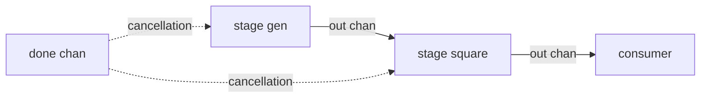

# pipeline

## Problem
Process a stream through several stages, where each stage is its own concurrent goroutine and they pass values through channels.

## When to use
- Stream processing (gen, filter, transform, sink).
- Each stage is a clear unit of work that can run independently.
- You want to apply backpressure naturally (a slow stage gates upstream).

## How it works


Each stage:
- owns its outbound channel and `close`s it when there are no more values,
- selects on `done` while sending so it can bail out early on shutdown.

A consumer's `close(done)` propagates upstream and unwinds the whole pipeline without leaking goroutines.

For a parallelized stage, see fan-out (which fits naturally between two pipeline stages).

## Example output
```
[main] running pipeline: gen -> square -> consumer
[stage gen]    sending 1
[stage gen]    sending 2
[stage square] 1 -> 1
[consumer]     got 1
[stage square] 2 -> 4
[stage gen]    sending 3
[stage gen]    sending 4
[stage square] 3 -> 9
[consumer]     got 4
...
[main] pipeline drained
```

## Run it
```bash
go run ./patterns/pipeline
```
