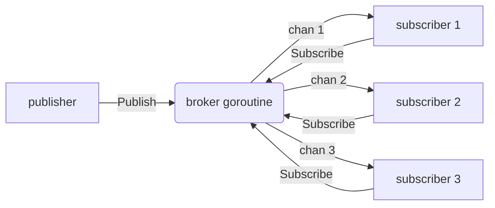

# pubsub-broadcast

## Problem
One publisher emits a stream of messages; many subscribers each want their own copy.

## When to use
- In-process event buses, websocket fan-out, in-memory notification systems.
- Anywhere you'd otherwise loop over a slice of channels manually.
- When subscribers come and go and the publisher should not have to know about any of them.

## How it works


A single broker goroutine owns a set of subscriber channels. `Subscribe` adds a new channel to the set; `Publish` fans the message out to every channel in the set; `Close` shuts the broker down and closes every subscriber channel.

Because the broker is the sole owner of the subscriber set, no mutex is needed. Subscribe, publish, and close all serialize through the same `select`.

**Slow-subscriber policy.** This implementation uses a non-blocking send (`select { case ch <- msg: default: drop }`) so one slow subscriber cannot stall the broker for everyone else. Each subscriber channel is small-buffered to absorb short bursts. Alternatives:

- block (back-pressure: publisher waits for the slowest subscriber),
- larger per-subscriber buffer (more memory, hides the problem),
- detach slow subscribers automatically.

Pick the policy that matches your latency vs. completeness needs.

**Related primitive.** For one-shot broadcasts (cancellation, "ready", shutdown), `close(done)` is the simpler primitive: every receive on a closed channel succeeds immediately, so `N` goroutines selecting on `done` all see it at once. See [graceful-shutdown](../graceful-shutdown) and [context-cancel](../context-cancel) for that pattern.

## Example output
```
[subscriber 3] online
[subscriber 1] online
[subscriber 2] online
[publisher] publishing "hello"
[subscriber 2] received "hello"
[subscriber 3] received "hello"
[subscriber 1] received "hello"
[publisher] publishing "world"
[subscriber 3] received "world"
[subscriber 1] received "world"
[subscriber 2] received "world"
...
[main] closing broker; subscribers will see channel close
[subscriber 2] channel closed, exiting
[subscriber 3] channel closed, exiting
[subscriber 1] channel closed, exiting
[main] done
```

Each of the five messages reaches every subscriber. The order in which subscribers within a single publish receive is non-deterministic (it depends on Go's map iteration order).

## Run it
```bash
go run ./patterns/pubsub-broadcast
```
