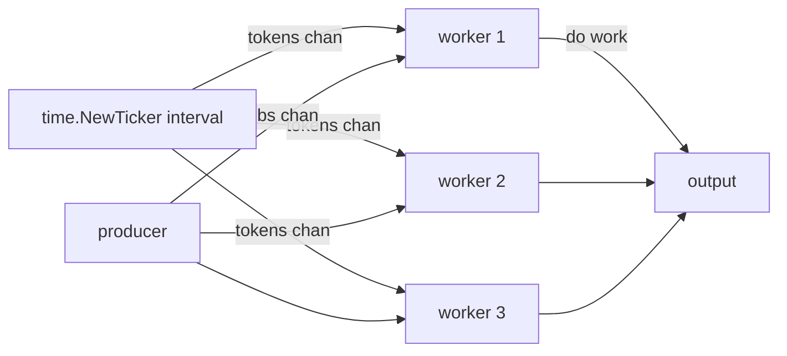

# rate-limit

## Problem
Cap the rate at which work happens (operations per second), independent of how many goroutines want to do it. The classic shape: throttle outbound API calls to honor an upstream's rate limit.

## When to use
- Honoring upstream rate limits (HTTP APIs, message brokers, DB write quotas).
- Smoothing bursty traffic so you don't pile load on a downstream.
- As a complement to [concurrency-limit-semaphore](../concurrency-limit-semaphore): a semaphore caps how many requests run *at once*; rate-limit caps how many start *per second*.

## How it works


`time.NewTicker(interval)` produces a `time.Time` value on its channel every `interval`. Each worker reads one token (`<-ticker.C`) before doing work, so the combined rate across all workers is exactly `1 / interval`. Adding more workers does not raise throughput; the ticker is the bottleneck.

Always `defer ticker.Stop()`. Without it the ticker's goroutine and timer leak until the program exits.

The first tick fires after `interval`, not immediately. To allow an initial burst, use a buffered channel that the ticker fills, and let the buffer absorb idle time. For more sophisticated needs (token bucket with burst, per-key limits, wait with cancellation) reach for `golang.org/x/time/rate` instead of building it by hand.

## Example output
```
[main] 12 jobs, 3 workers, rate=5 ops/sec (interval=200ms)
[worker 3] online
[worker 1] online
[worker 2] online
[worker 3] processed job  1 at +200ms
[worker 1] processed job  2 at +400ms
[worker 2] processed job  3 at +600ms
[worker 3] processed job  4 at +800ms
[worker 1] processed job  5 at +1s
[worker 2] processed job  6 at +1.2s
...
[worker 2] processed job 12 at +2.4s
[main] all done in 2.45s (theoretical min 2.4s at this rate)
```

Notice the spacing is exactly the configured 200ms regardless of how many workers are running.

## Run it
```bash
go run ./patterns/rate-limit
```
