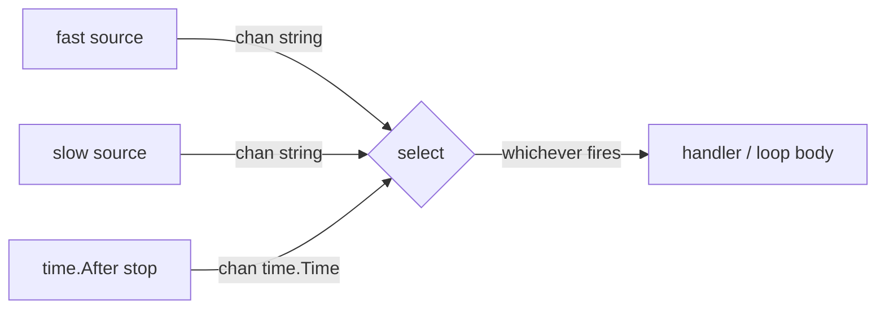

# select-loop

## Problem
A single goroutine needs to react to multiple channels (events, signals, timers) without spinning a separate goroutine per source.

## When to use
- One coordinator handling several async inputs.
- You want a clean shutdown path (`case <-stop:`) alongside normal work cases.
- Reading whichever source is ready first, instead of in a fixed order.

## How it works


The `for { select { ... } }` loop blocks until one of the channels is ready, runs that case, and goes back to waiting. With multiple ready cases, Go picks one pseudo-randomly so no source can starve the others.

## Example output
```
[main] multiplexing fast + slow until stop fires
[fast]   fast msg 0
[fast]   fast msg 1
[slow]   slow msg 0
[fast]   fast msg 2
[fast]   fast msg 3
[slow]   slow msg 1
...
[main] stop signal received, exiting
```

## Run it
```bash
go run ./patterns/select-loop
```
