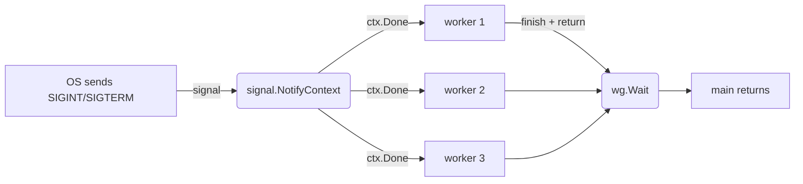

# signal-handling

## Problem
A long-running Go program needs to shut down gracefully when the OS sends `SIGINT` (Ctrl+C) or `SIGTERM` (orchestrator stop). Workers should finish what they are holding, release resources, and exit cleanly instead of being killed mid-flight.

## When to use
- Any production binary: HTTP servers, queue consumers, background workers, CLI tools that hold state.
- Container shutdown: Kubernetes / Docker send `SIGTERM` then `SIGKILL` after a grace period; you want to use the grace period.
- As the OS-layer counterpart to [graceful-shutdown](../graceful-shutdown) (in-process quit channel) and [context-cancel](../context-cancel) (in-process context).

## How it works


`signal.NotifyContext(parent, sig...)` (Go 1.16+) returns a child context that is cancelled when any of the listed signals arrive. Hand that context to every worker; they select on `ctx.Done()` and exit when it fires. `main` waits for the workers via `WaitGroup` and only then returns, so the program does not exit until cleanup is complete.

`defer stop()` is important: it disconnects the signal handler so subsequent signals get the default behavior (immediate termination). Without it, a second Ctrl+C is silently absorbed.

The example in `main.go` also wraps the signal context in a `context.WithTimeout(1.5s)` so the demo terminates without manual Ctrl+C. In real code you would just use `signal.NotifyContext` on its own.

## Example output

Demo run (auto-exits after 1.5s):

```
[main] starting workers (press Ctrl+C, or wait 1.5s for the demo timeout)
[worker 2] starting
[worker 2] tick 0
[worker 3] starting
[worker 3] tick 0
[worker 1] starting
[worker 1] tick 0
[worker 1] tick 1
...
[main] shutdown triggered by demo timeout, waiting for workers
[worker 1] shutdown received after 13 ticks, draining current work
[worker 2] shutdown received after 13 ticks, draining current work
[worker 3] shutdown received after 13 ticks, draining current work
[worker 1] exited
[worker 2] exited
[worker 3] exited
[main] all workers exited cleanly, goodbye
```

Real signal path (build the binary and Ctrl+C it after ~600ms):

```
...
[main] shutdown triggered by signal, waiting for workers
[worker 1] shutdown received after 3 ticks, draining current work
...
[main] all workers exited cleanly, goodbye
```

## Run it
```bash
go run ./patterns/signal-handling
```

To exercise the actual signal path, build first and Ctrl+C the binary (`go run` does not forward signals reliably to the child process):

```bash
go build -o /tmp/signal-handling ./patterns/signal-handling
/tmp/signal-handling
# press Ctrl+C
```
