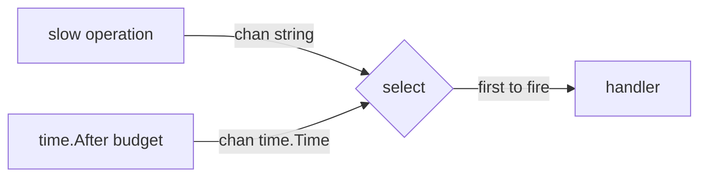

# timeout

## Problem
Bound how long you wait for a channel send or receive. If the work doesn't finish in time, give up and move on.

## When to use
- Calls to slow or unreliable upstreams.
- Any "I will wait at most N for an answer" situation.
- As a primitive when `context.WithTimeout` is overkill (single call, no propagation).

## How it works


`time.After(d)` returns a channel that fires once after `d`. Used inside a select, whichever channel fires first wins; if the operation channel is slower, the timeout case runs and the operation's result is discarded.

## Example output
```
[main] giving operation a 250ms budget
[op] simulating work that will take 411ms
[main] timeout: operation took longer than budget
```

## Run it
```bash
go run ./patterns/timeout
```
