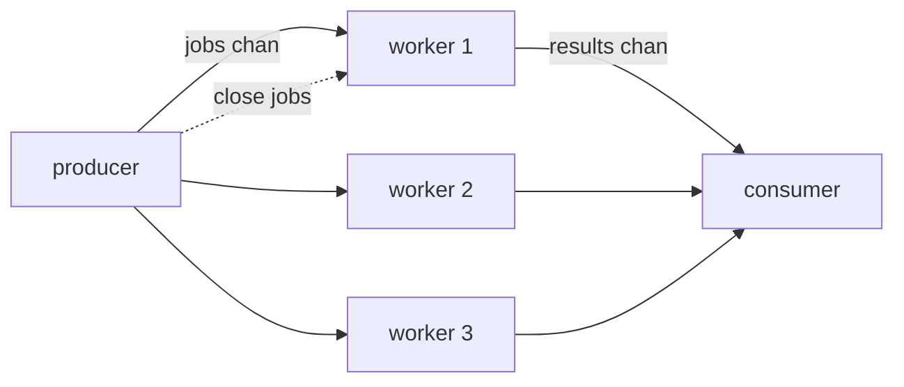

# worker-pool

## Problem
Many similar jobs need to run, but you don't want one goroutine per job (resource cost) or for them to run sequentially (too slow).

## When to use
- Steady streams of similar tasks (HTTP requests, file conversions, RPC fan-out).
- Bounded concurrency where you control the worker count.
- Jobs are independent and can be processed in any order.

## How it works


N long-lived workers `range` over a shared jobs channel. The producer `close`s the jobs channel when finished; that unblocks each worker's range loop and lets it exit. A `WaitGroup` waits for all workers to finish before closing the results channel so the consumer can range over results too.

Compare with [concurrency-limit-semaphore](../concurrency-limit-semaphore): same goal (cap concurrency) but the semaphore lets each task be its own goroutine and only gates the critical section.

## Example output
```
[worker 1] online
[worker 2] online
[producer] enqueue job 1
[worker 1] picked up job 1
[worker 2] picked up job 2
[worker 3] online
[worker 3] picked up job 3
...
[result]   worker 3 finished job 3 -> 9
[result]   worker 1 finished job 1 -> 1
...
[main] done
```

## Run it
```bash
go run ./patterns/worker-pool
```
